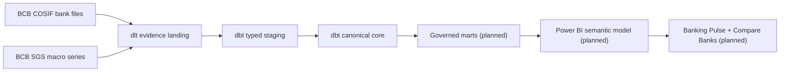
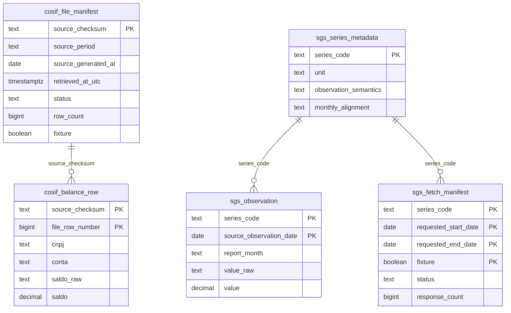
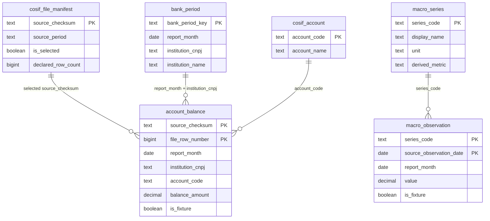

# Brazilian Banking Analytics — architecture and project guide

Updated: 2026-08-11

## Problem statement

Brazilian banking disclosures contain the evidence needed to explain how institutions
fund themselves, deploy capital and change through different interest-rate and credit
conditions. The raw material is difficult to use directly: balances arrive as large
account-level files, account meaning is hierarchical, files can be republished, bank
and conglomerate scopes must not be mixed, and macro series have different units and
interpretation rules.

The public-facing question is intentionally simpler than the source:

> Where do Brazil's largest banks get their money, where do they put it, and how has
> that changed under high interest rates?

## Proposed solution

Build a reproducible analytical product that retains official evidence but exposes a
small governed banking vocabulary:

The current implementation stops at the canonical core. Marts, top-15 membership,
reporting-line mappings and Power BI are deliberately withheld until the live source
profile proves which accounts can support them.

## Input data

### COSIF bank documents

The BCB catalog publishes one individual-bank file per reporting month. The MVP starts
in January 2025 to remain within the current COSIF standard and avoid a premature
cross-taxonomy bridge. Important source fields are:

| Field | Meaning in this project |
|---|---|
| `DATA_BASE` | Reporting month (`YYYYMM`) |
| `DOCUMENTO` | BCB document type; the observed current bank file uses 4010 |
| `CNPJ` / `NOME_INSTITUICAO` | Institution identity and source name |
| `CONTA` / `NOME_CONTA` | COSIF account code and description |
| `SALDO` | Locale-formatted balance in Brazilian reais |
| `COD_CONGL` / `NOME_CONGL` | Retained source context, not a license to sum scopes |
| `TAXONOMIA` | Source taxonomy context when present |

The acquisition manifest adds URL, SHA-256, source generation date, retrieval time,
completion state and row count. December 2025 currently has two published versions;
the later catalog record is selected deterministically. Full bodies remain outside
Git and retain the BCB ODbL boundary.

### Monthly macro context

The governed registry fixes five BCB SGS series from the beginning:

| Code | Theme | Native interpretation | MVP treatment |
|---|---|---|---|
| 4189 | Policy rate | Monthly Selic, annualized on a 252-business-day basis | Preserve native value; do not aggregate |
| 433 | Inflation | Monthly IPCA percentage change | Preserve monthly value; derive 12-month compounding later |
| 24363 | Activity | Unadjusted IBC-Br index | Level and year-over-year comparison only |
| 20539 | Credit | Month-end total credit portfolio stock | Never sum across months; compare levels/YoY |
| 21082 | Credit quality | Month-end total delinquency percentage | Percentage-point change, not additive aggregation |

Every observation retains its native date, exact decimal text/value, request URL and
retrieval timestamp. Macro relationships provide context and must not be presented as
causal explanations of bank performance.

## Architecture strategy and stack

| Layer | Choice | Why it fits |
|---|---|---|
| Acquisition | Python 3.12 + dlt | BCB files need custom ZIP/header/encoding semantics and SGS needs bounded API validation. dlt adds typed schema contracts, merge identities and load-package state without a service-heavy connector platform. |
| Warehouse | PostgreSQL 18 | Portable, transparent SQL, sufficient for the bounded volume and directly consumable by Power BI. It also makes local/CI parity straightforward. |
| Transformation | dbt Core + dbt-postgres | Explicit lineage, contracts, 106 current tests, generated documentation and a mature Dagster integration. |
| Orchestration | Dagster + `dagster-dlt` + `dagster-dbt` | Models the platform as 16 observable assets. Fixture and official modes preserve identical keys, so operational source choice does not fracture lineage. |
| Consumption | Power BI PBIP/TMDL (planned) | Matches the portfolio's BI focus and allows governed measures, version-controlled metadata and a clear mart-only boundary. |
| Packaging/CI | uv, Docker Compose, GitHub Actions | Locked Python resolution, PostgreSQL 18 parity and independently retained evidence for every checkpoint. |

### Why no Data Vault

Data Vault is useful when many independently changing source systems, business keys
and audit histories must be integrated. This MVP has one official source authority,
stable reporting identities and a short current-standard window. Checksum manifests
already preserve the required source evidence. Adding hubs, links and satellites
would increase navigation and transformation cost without solving a present problem.

The direct pattern—evidence landing, typed staging, canonical core, dimensional
marts—therefore demonstrates architectural judgment rather than a tool preference.
Restatement analytics or additional source families can trigger a new ADR later.

### Why dlt rather than Airbyte

Airbyte would add an always-on connector service while the difficult work remains
custom: locating the source header inside a ZIP, decoding CP1252, parsing Brazilian
decimals and enforcing catalog-selected file versions. dlt keeps that domain code
small and testable while still providing state, schema and merge behavior.

### Why dbt rather than SQLMesh

SQLMesh is a credible alternative, but dlt and Dagster already own ingestion and
orchestration state. Adding SQLMesh environments would introduce a third control
plane. dbt supplies the needed SQL contracts, tests, docs and asset integration with
less conceptual duplication for this project.

## Implemented layers

### Raw evidence landing

The five raw tables preserve source-shaped records and immutable acquisition context.
The relationships are logical lineage relationships; PostgreSQL foreign keys are not
required for ingestion.

### Typed staging

Staging is deliberately boring: rename Portuguese source columns, apply PostgreSQL
types, convert `YYYYMM` to a month date and expose lineage fields consistently. It
does not map COSIF accounts, aggregate balances or reinterpret macro values.

| Model | Grain and responsibility |
|---|---|
| `stg_cosif_file_manifest` | One typed file version/checksum |
| `stg_cosif_balance_row` | One typed physical account row inside a checksum |
| `stg_sgs_series_metadata` | One governed series definition |
| `stg_sgs_observation` | One native series/date observation |
| `stg_sgs_fetch_manifest` | One bounded request outcome |

### Canonical core

`cosif_file_manifest` retains all landed versions and marks one complete version per
period. `account_balance` only contains rows from that selected version. `bank_period`
and `cosif_account` are current canonical entities; neither is yet the stable top-15
population or a Type-2 history. Macro definitions and observations remain separate so
semantic rules are governed rather than embedded in a generic value column.

## Orchestration and operational gates

The default `fixture_end_to_end` job materializes all five raw assets followed by the
11 dbt assets. `BANKING_SOURCE_MODE=official` exposes `official_end_to_end` with the
same keys, but only when every persisted evidence path and macro bound is explicit.

Before an official load, `assess-readiness` publishes eight source controls and one
overall decision. The current live run is blocked because the BCB file and SGS hosts
return HTTP 502. The workflow preserves those errors, then skips PostgreSQL, dbt and
Dagster instead of loading partial evidence.

## Quality strategy

Current automated evidence includes:

- strict dlt column/type contracts and deterministic merge identities;
- checksum, ZIP CRC, member, encoding, delimiter, header and period validation;
- exact five-series registry and bounded monthly completeness controls;
- source, staging and core null/unique/accepted-value tests;
- file manifest versus account-row reconciliation;
- synthetic accounting identity reconciliation;
- macro grain and continuity tests;
- stable raw-to-dbt asset keys and executable Dagster checks;
- machine-readable ready/blocked controls before live mutation.

The current dbt graph contains 11 models and 106 tests. Passing fixtures prove the
mechanics and deliberate failure paths; official accounting reconciliation and
mapping coverage remain future exit gates.

## Important observations and challenges

1. **Official service availability:** the catalog is accessible, but both file and
   SGS observation hosts currently return HTTP 502 from local and GitHub runners.
   HTTP 5xx is unknown availability, never evidence that a period is absent.
2. **Headers are not necessarily row one:** COSIF files include metadata lines before
   the semicolon-delimited header. Acquisition searches for the required field set
   and records the header line number.
3. **Encoding and decimals are source semantics:** observed files use CP1252 and
   Brazilian values such as `1.234,56`. Raw text is retained beside exact `Decimal`
   values; floating point is not used.
4. **Republished months:** checksum is the immutable version identity. Catalog
   publication order plus generation/retrieval timestamps produces one deterministic
   selected version, while all manifests remain auditable.
5. **Scope cannot be casually summed:** individual institutions and consolidated or
   prudential scopes represent different populations. The MVP admits only individual
   bank files.
6. **Profitability is deferred:** COSIF result accounts reset in June and December;
   balance-sheet reporting lines are safer for the first release.
7. **Monthly macro values are heterogeneous:** rates, percentages, indexes and stocks
   cannot share one aggregation rule. The registry authors treatment per series.
8. **Generated artifacts matter:** clean Linux CI exposed terminal-width and missing
   dbt-manifest assumptions that local Windows state had hidden. Tests now avoid
   rendered CLI assertions and declare when a generated manifest is required.

## Implemented versus planned boundary

| Capability | State |
|---|---|
| Official catalog and active-version resolution | Implemented and live-verified |
| COSIF/SGS acquisition, profiling and readiness code | Implemented; live observations blocked by HTTP 502 |
| Strict dlt landing and PostgreSQL path | Fixture and mocked-official integration verified |
| dbt staging/core/tests/docs | Implemented and fixture-verified |
| Dagster fixture graph and official raw mode | Implemented and verified |
| Full official Dagster + dbt run | Defined; not certified |
| Reporting-line mapping and total-assets definition | Planned after live profile |
| Stable top-15 population and dimensional marts | Planned after mapping approval |
| Mart schema contract | Planned with marts |
| Power BI TMDL, pages and trust panel | Planned after contract freeze |

## Where to continue

1. Start with [the current handover](../HANDOVER.md) for the latest gate and exact
   retry command.
2. Use [the implementation plan](../plan/README.md) for scope and work-package
   sequencing.
3. Use [the source profile](source-profile.md) for live findings and blockers.
4. Generate the dbt catalog using the commands in [the dbt README](../dbt/README.md).
5. Review [third-party notices](../THIRD_PARTY_NOTICES.md) before publishing any BCB
   derivative data.
